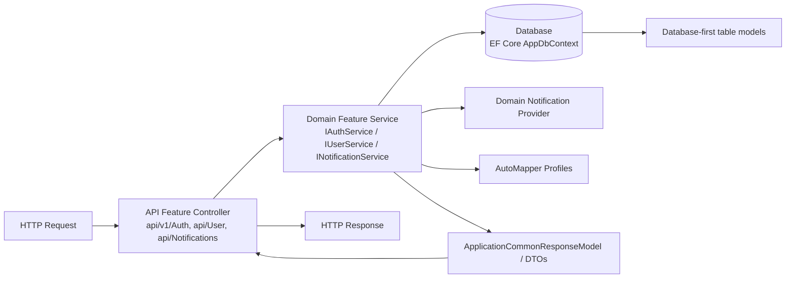

# HsumChaint_CSharp

## 1) Architecture overview (Phase 1)

This refactor keeps all public API contracts (routes, DTOs, and HTTP response behavior) intact while moving internal code to a feature-oriented structure.

### Current solution topology
- `HsumChaint.API`
- `HsumChaint.Domain`
- `HsumChaint.Database`
- `HsumChaint.Shared`

### Feature slices (non-breaking)
- `HsumChaint.API/Features/{Auth,User,Notification}/...`
- `HsumChaint.Domain/Features/{Auth,User,Notification}/...`
- `HsumChaint.Database/Models/...`

### Donation management scope
HsumChaint is now shaped as a mobile-ready backend for monastery donation management:
- users can register, login, and refresh JWT tokens
- monastery owners can create monastery spaces and manage members
- owners/admins can invite existing users into monastery roles
- donors can submit donation requests
- monastery owners/admins can manually record donations and review requests
- owners/admins/editors can schedule pickup/dropoff and complete donations
- donation lifecycle changes create database notifications and optionally send Firebase push when a user has an FCM token

### Cross-layer boundaries
- API handles HTTP entry only and delegates to Domain services.
- Domain handles feature orchestration, validation, auth/token flow, notification sending, and DTO-entity mapping.
- Database contains EF Core database-first `AppDbContext` and table models only.
- Shared stores cross-project configuration contracts and enums.

### Startup/Composition refactor
- `Program.cs` now focuses on host bootstrap + middleware + endpoint mapping.
- All registration is split into extension methods:
  - `HsumChaint.API/Extensions/DependencyInjectionExtensions.cs`
    - `AddApiServices`
    - `AddFirebaseConfiguration`
    - `AddJwtAuthentication`
  - `HsumChaint.Domain/Extensions/DependencyInjectionExtensions.cs`
  - `HsumChaint.Database/Extensions/DependencyInjectionExtensions.cs`
- Stage-aware config loading:
  - `HsumChaint.API/Extensions/StageConfigurationExtensions.cs`
  - `HsumChaint.API/Config/appsettings.json`
  - `HsumChaint.API/Config/custom-settings-{stage}.json` (for now: `custom-settings-development.json`)
  - `Program` calls `builder.AddStageConfig()` immediately after creation.

## 2) Feature flow diagram

## 3) Migration / onboarding note

### What moved
- API controllers moved from `HsumChaint.API/Controllers/*` into:
  - `HsumChaint.API/Features/Auth/Controllers`
  - `HsumChaint.API/Features/User/Controllers`
  - `HsumChaint.API/Features/Notification/Controllers`
- Application service logic and DTOs moved under feature folders in `HsumChaint.Domain/Features/...`.
- Repository logic was folded into Domain services so feature services use `AppDbContext` directly.
- EF Core database-first context and table models moved to `HsumChaint.Database/Models/...`.
- Shared enums/options moved from `HsumChaint.Common` to `HsumChaint.Shared`.

### Where to add new features
- Add each feature under:
  - `HsumChaint.API/Features/<Feature>/Controllers`
  - `HsumChaint.Domain/Features/<Feature>/{DTOs,ServiceInterfaces,Services}`
  - `HsumChaint.Database/Models` only when EF database-first scaffolding adds or refreshes table models.
- Register new services and database wiring through extension methods in:
  - `HsumChaint.API/Extensions/DependencyInjectionExtensions.cs`
  - `HsumChaint.Domain/Extensions/DependencyInjectionExtensions.cs`
  - `HsumChaint.Database/Extensions/DependencyInjectionExtensions.cs`

### Shared config placement
- Default/shared values: `HsumChaint.API/Config/appsettings.json`
- Stage-specific override values: `HsumChaint.API/Config/custom-settings-<stage>.json`
- Environment values continue to work through standard .NET configuration providers.

### Database script
- Complete local database setup is captured in:
  - `HsumChaint.Database/Scripts/000_create_local_database.sql`
- One round of local test seed data is captured in:
  - `HsumChaint.Database/Scripts/001_seed_test_data.sql`
- Donation-management schema additions for an existing older database are captured in:
  - `HsumChaint.Database/Scripts/20260831_complete_donation_management.sql`
- This project continues to follow the database-first approach; run the complete SQL script against local MySQL before using the API, then run the seed script when you need sample users, monastery, members, donations, invitations, notifications, and settings.

## 4) Mobile API summary

### Auth
- `POST /api/v1/Auth/register`
- `POST /api/v1/Auth/login`
- `POST /api/v1/Auth/refresh-token`

### Monasteries
- `POST /api/v1/monasteries`
- `GET /api/v1/monasteries/mine`
- `GET /api/v1/monasteries/{id}`
- `PUT /api/v1/monasteries/{id}`
- `POST /api/v1/monasteries/{id}/invitations`
- `POST /api/v1/monasteries/invitations/{invitationId}/respond`
- `GET /api/v1/monasteries/{id}/members`
- `PUT /api/v1/monasteries/{id}/members/{memberUserId}/role`
- `DELETE /api/v1/monasteries/{id}/members/{memberUserId}`

### Donations
- `POST /api/v1/donations/request`
- `POST /api/v1/donations/manual`
- `GET /api/v1/donations`
- `GET /api/v1/donations/{id}`
- `PUT /api/v1/donations/{id}/review`
- `PUT /api/v1/donations/{id}/schedule`
- `PUT /api/v1/donations/{id}/complete`
- `PUT /api/v1/donations/{id}/cancel`

## 5) Development commands
- Build: `dotnet build HsumChaint.slnx`
- Tests: `dotnet test HsumChaint.Tests/HsumChaint.Tests.csproj`
- Run API: `dotnet run --project HsumChaint.API`

## 6) Legacy notes
- `dotnet ef dbcontext scaffold ...` command kept below for database scaffolding tasks.
- `docker compose up --build`
